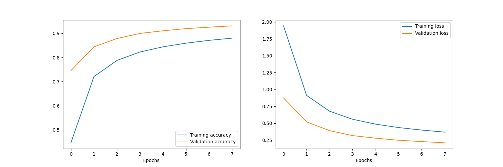

# Luogu Captcha Predict

## Introduction

Recognize [Luogu Captcha](https://www.luogu.com.cn/lg4/captcha) with AI model

## Usage

1. Make sure you have [TamperMonkey](https://www.tampermonkey.net/) or other UserScript managers installed in your browser.
2. Install the UserScript by file [predict.user.js](https://github.com/langningchen/luoguCaptcha/raw/refs/heads/main/predict.user.js).

## Development

### Current model info

- Training data is in the folder [`data`](data).
  **Caution: the folder has 1000 files in it, be careful when opening it in your browser!**
- Training history image:


### Data generator

The [`font`](font) folder contains the font files for generate the images.
The data generator is [`generate.php`](generate.php), and the [`generate.py`](generate.py) is a wrapper of the php file.

- generate.php
  - When there is no arguments passed to the file, generate a captcha, output the captcha answer to `stdout` and write image to file `captcha.jpg`.
  - When there is one arguments (`tot`) passed to the file, the parameter must be an integer.
    The program will generate `tot` images, connect all image data directly and output to `stdout`.
    Each image is output in the following format:
    - First 2 bytes (`len`): the length of the image data
    - Next 4 bytes: the captcha answer
    - Next `len` bytes: the binary image data
- generate.py
  - Require three arguments: `BatchNumber` `WorkersCount` `BatchSize`.
    It generates `BatchNumber` image batch files in the [`data`](data) directory, each file contains `BatchSize` images, working with `WorkersCount` subprocesses.
    The batch files are named as `Data_([0-9]+)\.pkl`

### Model training

The file [`train.py`](train.py) trains the model in `TensorFlow` with the data generated in the folder [`data`](data).
The output model files is [`luoguCaptcha.keras`](luoguCaptcha.keras), the output train history file is [`trainHistory.png`](trainHistory.png).

The detailed model is shown below:
- Epochs: 8
- Layers:

| Name   | Type           | Output shape                    |
|:-------|:---------------|:--------------------------------|
| input  | `input`        | (35, 90, 3)                     |
| con1   | `Conv2D`       | (33, 88, 32)                    |
| pol1   | `MaxPooling2D` | (16, 44, 32)                    |
| con2   | `Conv2D`       | (14, 42, 64)                    |
| pol2   | `MaxPooling2D` | (7, 21, 64)                     |
| con3   | `Conv2D`       | (5, 19, 128)                    |
| pol3   | `MaxPooling2D` | (2, 9, 128)                     |
| flat   | `Flatten`      | (2304,)                         |
| drp    | `Dropout`      | (2304,)                         |
| des1   | `Dense`        | (1024,)                         |
| des2   | `Dense`        | (`CharsPerLabel` * `CharSize`,) |
| output | `Reshape`      | (`CharsPerLabel`, `CharSize`)   |

> In this model, the `CharsPerLabel` is 4, `CharSize` is 128

### Predicting captcha

The file [`predict.py`](predict.py) predicts the captcha.

- When there is no arguments passed to the file, predict the image `captcha.jpg` and output the answer in the `stdout`.
- When there is one argument (`port`) passed to the file, run an HTTP server on port `port`, and it only has one API.
  - **URL**: `/`
  - **Request Method**: `POST`
  - **Request Body**: A JSON as the following format
    ```json
    {
        "image": "base64 encoded image file"
    }
    ```
  - **Response Body**: A JSON as the following format
    ```json
    {
        "prediction": "the captcha answer"
    }
    ```
    
## License

This project is licensed under the terms of the GNU General Public License v3.0.
